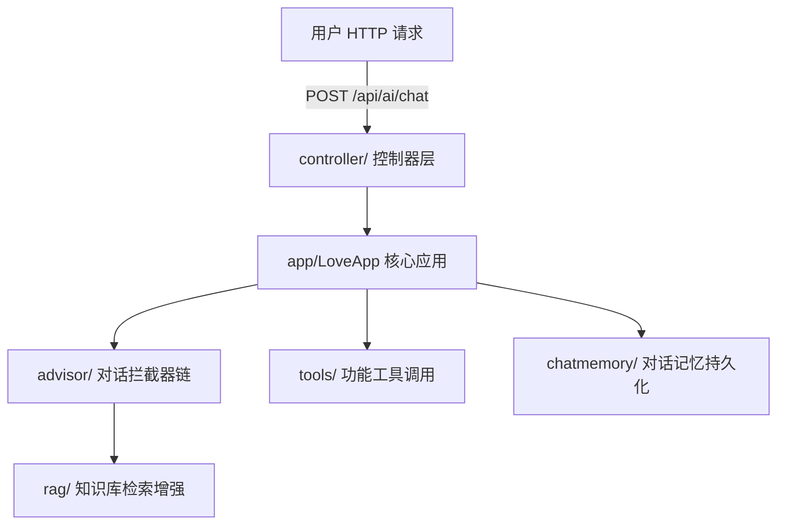
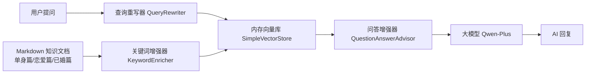
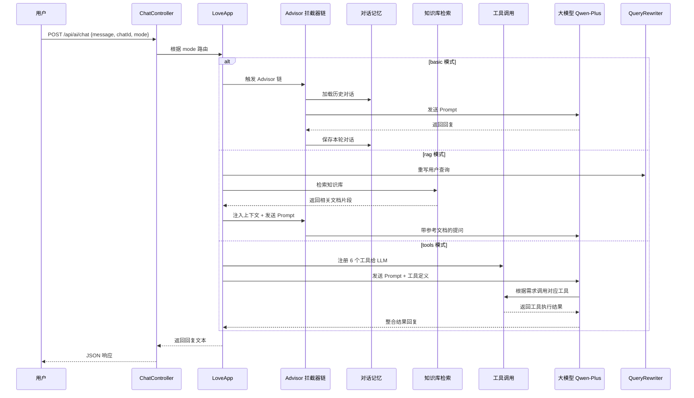

# 项目分析报告：ai-agent

> **生成日期**：2026-06-24  
> **项目路径**：`D:\IdeaProjects\ai\ai-agent`  
> **技术栈**：Spring Boot 3.4.4 + Java 21 + Maven

---

## 一、项目概述

**ai-agent** 是一个基于 **Spring AI Alibaba + DashScope（通义千问）** 构建的 AI Agent（智能体）应用，核心功能是一个名为 **"恋爱大师"** 的情感咨询对话机器人。

项目以 Spring Boot 微服务架构为基础，集成了大语言模型（LLM）调用、RAG 检索增强生成、功能工具调用（Function Calling）、对话记忆持久化、PDF 生成、网页搜索与爬取等能力。

---

## 二、模块拆解

根据包结构（`com.donggua.aiagent`）和功能职责，项目可分为以下 **8 大模块**：

```text
com.donggua.aiagent
├── controller/          # ① 控制器层（API 入口）
├── app/                 # ② 核心业务层（AI 应用逻辑）
├── advisor/             # ③ 对话拦截器（Advisor 链）
├── rag/                 # ④ 知识库检索增强（RAG）
├── tools/               # ⑤ AI Function Tool（工具调用）
├── chatmemory/          # ⑥ 对话记忆持久化
├── constant/            # ⑦ 常量配置
├── demo/                # ⑧ 技术验证 Demo
│   ├── invoke/          #    多种方式调用 AI 模型
│   └── rag/             #    RAG 查询扩展演示
```

### 模块关系图



---

## 三、各模块功能分析

### ① 控制器层（controller/）

| 文件 | 路径 | 功能 |
|------|------|------|
| `ChatController.java` | `POST /api/ai/chat` | **对话接口**，接收用户消息、chatId、mode 参数，支持三种模式 |
| `HealthController.java` | `GET /api/health` | **健康检查接口**，返回 "ok" |

**核心流程**：`ChatController` 接收请求后，根据 `mode` 参数分流到 `LoveApp` 的不同方法：

- `basic` → 基础对话
- `rag` → 带知识库检索的对话
- `tools` → 带工具调用的对话

---

### ② 核心业务层（app/）

| 文件 | 功能 |
|------|------|
| `LoveApp.java` | **"恋爱大师" 情感咨询 AI 应用**，项目核心 Bean |

**核心能力**：

1. **基础对话**（`doChat`）：调用大模型 + 对话记忆拦截器，支持多轮对话
2. **知识库对话**（`doChatWithRag`）：调用大模型 + 查询重写 + 本地向量库检索
3. **云端 RAG 对话**（`doChatWithRagCloud`）：使用阿里云百炼知识库服务
4. **工具对话**（`doChatWithTools`）：AI 调用注册好的工具函数
5. **结构化输出**（`doChatWithReport`）：将 AI 回复解析为 `LoveReport` 结构化对象
6. **多模态识别**（已注释）：支持图片识别（阿里多模态 API）

**系统提示词**：设定 AI 为 "高级情感指导师"，采用引导式提问方式分析恋爱问题，禁止 PUA、毒鸡汤、越界建议等。

---

### ③ 对话拦截器层（advisor/）

| 文件 | 功能 |
|------|------|
| `ForbiddenWordAdvisor.java` | **违禁词检查**，拦截用户输入和 AI 回复中的敏感词（赌博、毒品、暴力等） |
| `MyLoggerAdvisor.java` | **日志记录**，打印每次请求和响应的消息内容 |
| `ReReadingAdvisor.java` | **"Re2" 重读增强**，在用户提问后追加 "Read the question again"，提升大模型理解能力 |

**拦截器链执行顺序**：
1. `MessageChatMemoryAdvisor`（对话记忆）
2. `ForbiddenWordAdvisor`（违禁词检查，优先级最高 `order = -1`）
3. `MyLoggerAdvisor`（日志记录）
4. `ReReadingAdvisor`（重读增强，当前已注释）

---

### ④ 知识库检索增强模块（rag/）

| 文件 | 功能 |
|------|------|
| `PgVectorStoreConfiguration.java` | **PGVector 向量库配置**（当前已注释），使用 PostgreSQL + pgvector 扩展 |
| `LoveAppVectorStoreConfiguration.java` | **内存向量库配置**，使用 `SimpleVectorStore`，加载 Markdown 文档并存入内存向量库 |
| `LoveAppDocumentLoader.java` | **Markdown 文档加载器**，读取 `classpath:document/*.md`，按水平线拆分为文档片段 |
| `LoveAppRagCloudAdvisorConfiguration.java` | **阿里云百炼知识库配置**，通过 DashScope API 连接云端知识库 |
| `LoveAppRagCustomAdvisorFactory.java` | **自定义 RAG Advisor 工厂**，支持按 status 字段过滤检索（如单身/恋爱/已婚） |
| `LoveAppContextualQueryAugmenterFactory.java` | **上下文查询增强器工厂**，无匹配时返回自定义提示（"只能回答恋爱相关问题"） |
| `MyKetWordEnricher.java` | **关键词元数据增强器**，利用 AI 为文档自动生成关键词标签 |
| `MyTokenTextSplitter.java` | **Token 文本切分器**，将长文档按 Token 切分为片段 |
| `QueryRewriter.java` | **查询重写器**，在用户提问后由 AI 自动重写，提升检索引擎命中率 |

**RAG 架构**：



---

### ⑤ 功能工具调用模块（tools/）

| 文件 | 功能 |
|------|------|
| `ToolRegistration.java` | **工具注册配置类**，将 6 个工具注入为 Spring Bean |
| `WebSearchTool.java` | **百度搜索工具**，通过 SearchAPI.io 调用百度搜索引擎，返回前 5 条结果 |
| `WebScrapingTool.java` | **网页爬取工具**，基于 Jsoup 抓取指定 URL 的 HTML 内容 |
| `FileOperationTool.java` | **文件读写工具**，读取和写入 `tmp/file/` 目录下的文件 |
| `ResourceDownloadTool.java` | **资源下载工具**，从 URL 下载文件到 `tmp/download/` 目录 |
| `TerminalOperationTool.java` | **终端操作工具**，执行 `cmd /c` 命令并返回输出 |
| `PDFGenerationTool.java` | **PDF 生成工具**，基于 iText 将文本内容生成 PDF 文件到 `tmp/pdf/` |

**工具调用场景**（来自测试代码）：
- 搜索约会推荐地点 → `WebSearchTool`
- 查看网页上他人如何解决感情矛盾 → `WebScrapingTool`
- 下载情侣壁纸图片 → `ResourceDownloadTool`
- 执行 Python 脚本生成数据分析报告 → `TerminalOperationTool`
- 保存恋爱文档 → `FileOperationTool`
- 生成"七夕约会计划"PDF → `PDFGenerationTool`

---

### ⑥ 对话记忆持久化模块（chatmemory/）

| 文件 | 功能 |
|------|------|
| `FileBasesChatMemory.java` | **基于文件的对话记忆持久化**，实现 Spring AI 的 `ChatMemory` 接口 |

**实现细节**：
- 使用 **Kryo** 序列化框架将对话消息存入文件（`.kryo` 格式）
- 以 `conversationId.kryo` 命名，存储在 `tmp/chat-memory/` 目录
- 支持新增单条/多条消息、按 conversationId 查询、清空对话

---

### ⑦ 常量配置模块（constant/）

| 文件 | 功能 |
|------|------|
| `FileConstant.java` | 定义文件存储根目录为 `user.dir + "/tmp"` |

---

### ⑧ 技术验证 Demo 模块（demo/）

#### invoke/ - AI 调用方式演示

| 文件 | 功能 |
|------|------|
| `HttpAiInvoke.java` | 使用 **Hutool HTTP** 直接调用 DashScope API |
| `SDKAiInvoke.java` | 使用 **DashScope SDK**（`Generation` 类）调用通义千问 |
| `SpringAiAiInvoke.java` | 使用 **Spring AI 框架** 调用大模型（`ChatModel` Bean） |
| `LangChainAiInvoke.java` | 使用 **LangChain4j** 框架调用（代码已注释） |
| `TestApiKey.java` | 统一的 API Key 接口定义 |

#### rag/ - RAG 查询扩展演示

| 文件 | 功能 |
|------|------|
| `MultiQueryExpanderDemo.java` | **多查询扩展器 Demo**，将用户问题扩展为 3 个相关查询 |

---

## 四、知识库文档

位于 `src/main/resources/document/` 目录，共 3 篇 Markdown 文档：

| 文档 | 文件名标记 | 内容 |
|------|-----------|------|
| 单身篇 | `...单身篇.md` | 如何提升魅力、社交场合交友、线上交友注意事项、克服恋爱焦虑等 |
| 恋爱篇 | `...恋爱篇.md` | 制造浪漫惊喜、保持自我、有效沟通、化解争吵技巧等 |
| 已婚篇 | `...已婚篇.md` | 婚后亲密关系维护、家庭规划沟通、矛盾化解等 |

文档由 `LoveAppDocumentLoader` 加载，按水平线拆分后，经关键词增强器处理，存入向量数据库供 RAG 检索。文档中的 `status` 字段（"单身"/"恋爱"/"已婚"）可用于过滤检索。

---

## 五、配置文件体系

### `application.yml` — 主配置

| 配置项 | 值 |
|--------|-----|
| 服务端口 | `8123` |
| Context Path | `/api` |
| SpringDoc API 文档 | 开启，Knife4j 增强 |
| 日志级别 | `org.springframework.ai: DEBUG` |

### `application-local.yml` — 本地环境配置

| 配置项 | 值 |
|--------|-----|
| DashScope API Key | `sk-f74d55ef143c492c8b261ad518823f27` |
| 模型 | `qwen-plus` |
| PGVector 配置 | 阿里云 RDS PostgreSQL, 1024 维, HNSW 索引, 余弦距离 |
| 数据库连接 | `rm-cn-y6e4tjdd3000165o.rwlb.rds.aliyuncs.com:5432/donggua_ai_agent` |

---

## 六、项目依赖分析

| 依赖 | 用途 |
|------|------|
| `spring-boot-starter-web` | Web 服务基础 |
| `dashscope-sdk-java` | 阿里通义千问大模型 SDK |
| `spring-ai-alibaba-starter-dashscope` | Spring AI Alibaba 集成 DashScope |
| `spring-ai-alibaba-agent-framework` | Spring AI Agent 框架 |
| `spring-ai-markdown-document-reader` | Markdown 文档读取 |
| `spring-ai-advisors-vector-store` | 向量库 Advisor |
| `spring-ai-pgvector-store` | PGVector 向量存储 |
| `spring-boot-starter-jdbc` + `postgresql` | PostgreSQL 数据库连接 |
| `knife4j-openapi3-jakarta` | API 文档（Swagger UI 增强） |
| `hutool-all` | Java 工具类库 |
| `jsoup` | HTML 网页解析 |
| `itext-core` | PDF 文件生成 |
| `kryo` | Java 序列化（对话记忆持久化） |
| `jsonschema-generator` | JSON Schema 生成（结构化输出） |
| `langchain4j-community-dashscope` | LangChain4j 集成 DashScope |

---

## 七、对话流程完整链路



---

## 八、测试覆盖情况

`src/test/java/` 下有以下测试：

| 测试类 | 测试内容 |
|--------|---------|
| `AiAgentApplicationTests.java` | 应用上下文加载测试 |
| `LoveAppTest.java` | 恋爱大师各模式对话测试（basic/RAG/RAG Cloud/Tools） |
| `PgVectorStoreConfigurationTest.java` | 向量库配置测试 |
| `FileOperationToolTest.java` | 文件读写工具测试 |
| `PDFGenerationToolTest.java` | PDF 生成工具测试 |
| `ResourceDownloadToolTest.java` | 资源下载工具测试 |
| `TerminalOperationToolTest.java` | 终端操作工具测试 |
| `WebScrapingToolTest.java` | 网页爬取工具测试 |
| `WebSearchToolTest.java` | 百度搜索工具测试 |
| `MultiQueryExpanderDemoTest.java` | 多查询扩展器 Demo 测试 |

---

## 九、项目特点总结

1. **多模式对话**：支持基础对话、RAG 增强对话、工具调用对话三种模式
2. **多元化的 AI 调用方式**：同时保留 HTTP 直调、DashScope SDK、Spring AI、LangChain4j 四种技术方案
3. **丰富的工具集**：6 个可被 AI 调用的工具，覆盖搜索、爬取、文件操作、命令执行、PDF 生成
4. **本地 + 云端双 RAG**：既有基于内存向量库的本地知识检索，也有阿里云百炼云端知识库
5. **可扩展的 Advisor 链**：通过 Spring AI Advisor 机制实现拦截器模式，支持日志、审核、提示增强
6. **文件级对话记忆**：自定义基于 Kryo 序列化的持久化方案，Spring 启动时自动恢复对话上下文
7. **中文友好**：API 文档使用 Knife4j（中文 UI）、系统提示词均为中文、知识库为中文恋爱题材
